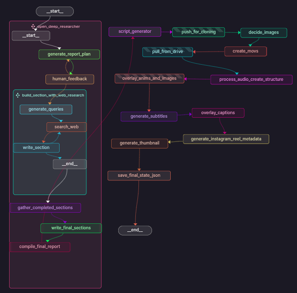
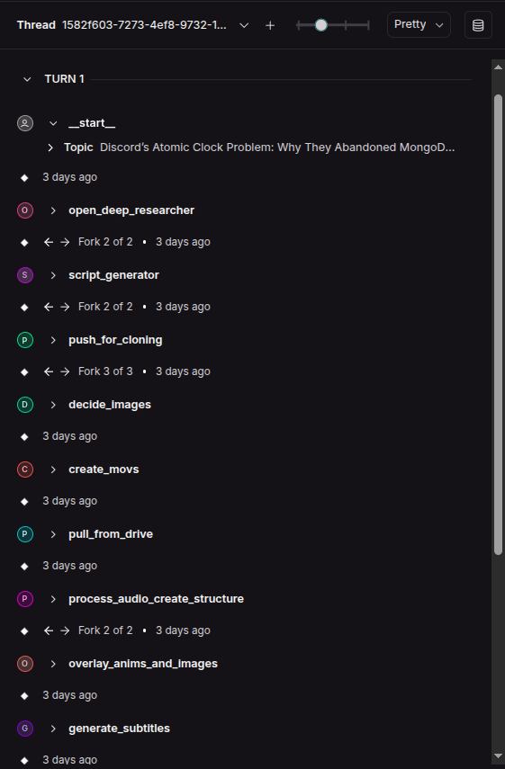

# AI-Driven Instagram Reels Automation Pipeline

This project automates the process of creating Instagram Reels by breaking down complex technical topics (like backend infrastructure) into engaging, digestible short videos. The pipeline was originally based on the open-source [Open Deep Researcher](https://github.com/langchain-ai/open_deep_research) and re-engineered with **LangGraph**, Python logic, and agent-based workflows to automate everything—from data retrieval to posting the final video.

## Creates in <20 mins (↓ from 6+ hrs) at <$0.20/video. Consistently post tech-related content, reaching ~5.5K followers and over 450K total views.

---

### Sample Reel
Check out a sample Instagram Reel created by this pipeline:

[Watch the demo video](https://github.com/aditya-ladawa/infra_peter/blob/main/assets/CAPTIONED_why_uber_ditched_postgres_at_scale.mp4)

---

### Live Automation in Action

- **Instagram Channels**
  1. [@infra.peter](https://www.instagram.com/infra.peter/)  
  2. [@fullstack_chandler](https://www.instagram.com/fullstack_chandler/)  

- Previously tested on a **YouTube channel**: [@the_inner_lab](https://www.youtube.com/@the_inner_lab/shorts)

---

### Key Features

- **No Prompt Engineering**: The pipeline is driven by structured state and Python logic—there's no need for complex prompt engineering.
- **End-to-End Automation**: Automatically pulls data, writes scripts, edits media, adds captions, and posts Reels on Instagram.
- **LangGraph Integration**: The pipeline leverages **LangGraph** to orchestrate state management without worrying about the underlying computation.
- **Scalable Workflow**: Scalable for consistent, high-volume Reels generation.

---

### How It Works

1. **Topic Input**: Provide a topic for the Instagram Reel.
2. **Data Fetching**: The pipeline fetches relevant data based on the topic.
3. **Script Generation**: Automatically generates a script from the fetched data.
4. **Media Editing**: The script is paired with media, and the system edits the video.
5. **Metadata & Captions**: The pipeline automatically generates captions and metadata for Instagram posts.
6. **Posting**: Once the video is ready, it is posted to Instagram automatically.

---

### Why LangGraph?

LangGraph is used for its agnostic approach to computation—it manages the state of the pipeline without worrying about how each task is executed. This makes the system modular and easily adaptable, ensuring flexibility and scalability across different workflows.

---

### Screenshots

#### LangGraph Workflow

This image shows the **LangGraph** workflow that powers the entire system.

#### Example Flow in LangGraph

Here's an example of how the individual nodes in **LangGraph** connect and process tasks.

---

### Acknowledgements
LangGraph for enabling seamless state tracking and workflow orchestration. (https://langchain-ai.github.io/langgraph/concepts/why-langgraph/)

ResembleAI for TTS (Text-to-Speech) capabilities. (https://github.com/resemble-ai/chatterbox)

FasterWhisper for audio syncing. (https://github.com/SYSTRAN/faster-whisper)

OpenDeepResearcher for providing the foundation of the project. (https://github.com/langchain-ai/open_deep_research)

